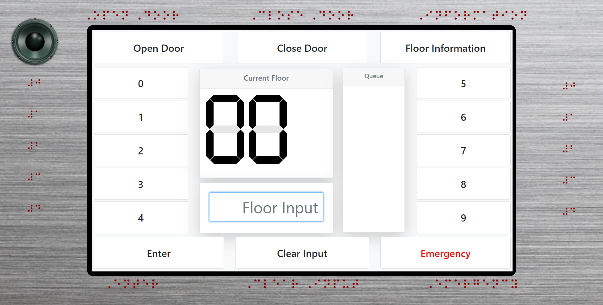

# Report 

### Links
[Presentation page](https://tasniaheya.github.io/CS3366/) ( https://tasniaheya.github.io/CS3366/)

[GitHub repository](https://github.com/tasniaheya/CS3366/) ( https://github.com/tasniaheya/CS3366/)

[Demo](https://tasniaheya.github.io/CS3366/demo.html) ( https://tasniaheya.github.io/CS3366/demo.html)

[Video](https://www.youtube.com/embed/zNnTnfFN9p0) ( https://www.youtube.com/embed/zNnTnfFN9p0 )

<iframe width="560" height="315" src="https://www.youtube.com/embed/zNnTnfFN9p0" frameborder="0" allow="accelerometer; autoplay; encrypted-media; gyroscope; picture-in-picture" allowfullscreen></iframe>

### For Getting C

#### Example elevator:
- Control interface of Holden Hall Elevator of TTU in given below.

- Animation Example:

#### Issues:
- In this interface, basement is indicated with G where basement generally is indicated with B which is convenient for any user to understand.
- In this interface “ *V” has been used which can be very confusing as it is not a general practice. 

#### Why it is Bad:
- Using “G” for basement can be misleading for any user especially for the disable people.
- “ *V” has been used for the ground floor where the lift starts. There can be huge confusion for people to understand this sign as it is not usually used like this and there is another button which indicates “G”. People with disabilities can misunderstand G as ground floor instead of “ *V”.
- The alignment of the buttons are odd looking and could be better.

### For Getting B

#### Common Functions of Elevator:

- Bottom floor consists only the up button, the top floor consists only down button, and floors in between consists both buttons on the outside to call a lift.
- Buttons to open and close the door inside the lift 
- Buttons to choose a floor number
- Alarm to control overload using sensor to prevent the excess load of the lift after exceeding the weight requirement of the lift
- Call cancellation to deselect by a button or double clicking
- An alarm button to give signal for help when trapped in the elevator
- Motion sensor which detects if someone is passing in between the door of the lift and does not closes till being empty
- Manually open or closing lock system for the technicians or managers which can be only accessed with a key

#### Other Functions of Elevator:
- Electric fans or air conditioning units to enhance circulation and comfort.
- Raised braille text beside buttons and icons to help blind users to operate the lift
- In some of the elevators, there is call option for emergency to talk to the management in emergency situation in case the alarm button is not so useful
- In some lifts, there is an additional screen which shows information about the different floors of that building
- There can be audio system where user can listen in which floor they are or which floor they have selected
- Some Lifts have voice command option which is rare though
- Some lifts also have touch screen control system instead of manual buttons

#### Common Sequence of Actions:
- Pushing the up or down button outside the elevator to call the lift
- After entering the lift, pressing the control button of desired floor number
- Sometimes pressing closing button to close the door if no one else has to enter the lift
- After reaching in the desired floor, user gets out of the lift
- User can figure out sign given in the control function or using voice instructions or sometimes information is written in the lift body so that user can easily figure out how to make it work.
- Sometimes user gets feedback via audio or display.
- With the current given interface user can easily get confused and go to the basement thinking of G as ground floor. Moreover, in this interface cancel call button cancels all the calls if there are multiple calls. The interface could be simpler and concise as control functions are scattered and not so easy to understand.

 

A sketch of the proposed design is given below.

### For Getting A

#### Proposed Design:

The proposed design is given below.

##### Screen size:
- 1366x768 ratio is the best use for this interface. This resolution ratio is commonly used in manufacturing touch supported screens.
- A minimum 7 inch display should be ideal to use for this interface.

#### Design and Implementation:

- A touch screen provides flexibility to design such a control interface that we can place the buttons to the edges, so that it can also be used for Brails support.
- Digits from 0 to 9 placed on both sides of the screen.
- 6 other buttons needs to be placed on the screen. They are: Open Door, Close Door, Floor Information, Emergency, Enter, Clear Input.
- Open Door: By pressing this, the elevator doors opens.
- Close Door: This enables the user to close the doors.
- Floor information: By using this a user can listen to the outlets or offices of the current floor. Which may also help a visually impaired person to use this feature. 
- Emergency: This button will trigger the emergency state, it will let the elevator operators know there is an emergency. In the meantime in the elevator control interface 
- Emergency will be shown as status and will play an audio which says “Emergency. Please do not panic, help is on the way.”
- Enter: This enables the pressed digits to be added to the queue.
- Clear Input: This will clear the inputs, which may have been inserted by user mistakenly.
- The corners of the screens are easily accessible. As there are four corners, 4 top prioritized buttons are placed in the four corners. They are: Open door, Floor information, - Enter and Emergency. The rest of the buttons (Close door, Clear input ) in the middle of the two buttons of each side (Up and down).
- On top 3 buttons are placed, they are: Open Door, Close Door and Floor information.
- On bottom 3 buttons are placed, they are: Enter, Clear input and Emergency.
- A screenshot of the implemented control interface is given below.

##### How it works:
- The user needs to input the digits of the desired floor and press enter. This will add the floor to the queue and organize it according to the best option.
- If the floor is going down, the floors below the current floor are prioritized and are sorted in a descending order.
- If the floor is going up, the floors that are above the current floor are prioritized and are sorted in ascending order.
- If the lift is not going anywhere, it will go to the first entry in the queue.

##### Design and implementation of user feedback
- The user gets feedback from speaker, reading out notifications of reached floor, floor selection, emergency, door open, door close and input clear.
- The UI shows feedback as visual of current floor and also indicated if it is going up or down.

##### Implementation:
- The implementation is developed using html, css and javascript.
- Bootstrap 3 was used to design the interface.
- The display is developed and placed in a display.html file.
- In order to visually show how the screen will be placed in the elevator body with the Brails text, another html file is made, with elevator body design and a screen display containing the display.html in iframe.
- For the text-to-speech feature, a library is used from responsivevoice.org
- Javascript is used to put the logics of the elevator.

### For Extra Credits

#### Extra Features:
- The buttons are placed in such a manner that all the buttons are accessible around the edges of the screen
- This enables us to place Brails text around the screen edges in the physical body of the elevator according to the buttons.
- Brails support enables visually impaired people to use the elevator
- The elevator has a voice support using the text to speech technology, which enables visually impaired people to listen to important notifications in the elevator.
- The queue is displayed as it enables the users to be informed of the floor queue.
- A status panel enables users to visually see the current notifications.
- “Floor Information” reads out the outlets/offices in the current floor, which will help the users to figure out what offices/outlets are in the floor.
